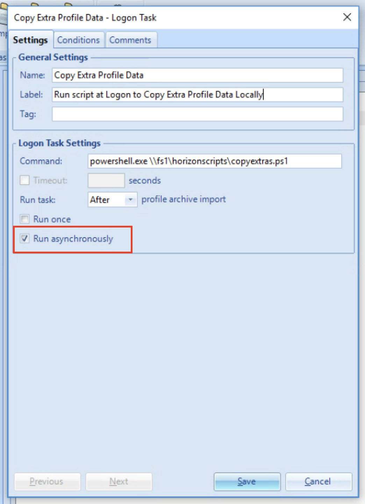

# persona-copy-extras

Josh Spencer / Chris Halstead - VMware
This script is provided as-is and there is no support

Version 1.0 - May 8 2020

------

### Overview

This script is used to copy all data contained in a VMware Horizon Persona Management environment that is stored in non-standard folder.  The folders managed by VMware Horizon Persona Management are detailed here: 

https://docs.vmware.com/en/VMware-Horizon-7/7.12/horizon-architecture-planning/GUID-05B1BE12-8DD2-4EAE-A3E2-B52CDB6DFC32.html

We can copy these standard folders locally using a group policy setting, but any extra folders and files are not copied locally.  The local profile will use either an VMware App Volumes Writable Volume or an FSLogix Profile Container.  This script will copy any non standard folders/files from the VMware Horizon Persona Management to this local profile location.  This will allow the migration away from VMware Horizon Persona Management.  

### Usage

$PMpath = "**\\\fqdnoffileserver\share**\" + $un + ".v6"

### Change Log

